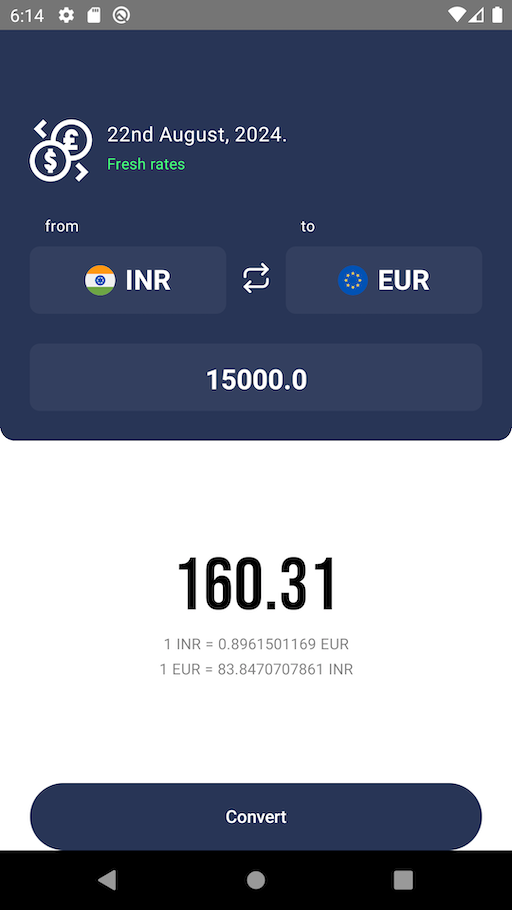
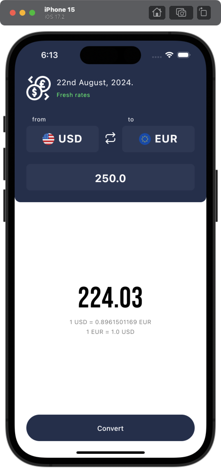
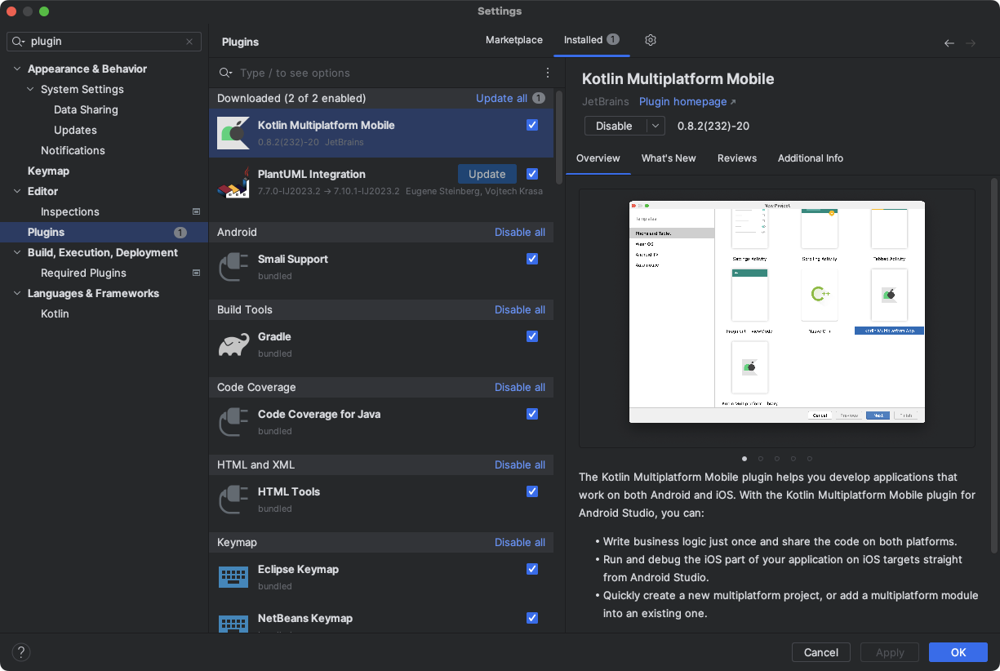

# Compose Multiplatform Projects

 

https://github.com/JetBrains/compose-multiplatform  

Compose Multiplatform is a declarative framework for sharing UIs across multiple 
platforms with Kotlin. It is based on Jetpack Compose and developed by JetBrains 
and open-source contributors.

You can choose the platforms across which to share your UIs using Compose Multiplatform:

- iOS (Beta)
- Android
- Desktop (Windows, MacOS, Linux)
- Web (Alpha)
- For example, you can share UIs between iOS and Android or Windows and MacOS.

https://www.jetbrains.com/fleet/  

https://developer.android.com/studio  

https://developer.apple.com/xcode/  


# Live Action Screenshots

| Running on an Android Pixel Emulator |
| :--------------------------------: |
|  |

| Running on an iOS iPhone 15 Simulator |
| :--------------------------------: |
|  |


# Environment Setup

```shell
brew install kdoctor

[!] CocoaPods
  ! CocoaPods configuration is not required, but highly recommended for full-fledged development
  ✖ System ruby is currently used
    CocoaPods is not compatible with system ruby installation on Apple M1 computers.
    Please install ruby via Homebrew, rvm, rbenv or other tool and make it default
    Detailed information: https://stackoverflow.com/questions/64901180/how-to-run-cocoapods-on-apple-silicon-m1/66556339#66556339
```

```shell
brew install ruby

echo 'export PATH="/usr/local/opt/ruby/bin:$PATH"' >> ~/.zshrc

kdoctor

Environment diagnose (to see all details, use -v option):
[✓] Operation System
[✓] Java
[✓] Android Studio
  ! Android Studio (AI-221.6008.13.2211.9619390)
    Location: /Applications/Android Studio Electric Eel.app
    Bundled Java: openjdk 11.0.15 2022-04-19
    Kotlin Plugin: 221-1.8.0-release-for-android-studio-AS5591.52
    Kotlin Multiplatform Mobile Plugin: not installed
    Install Kotlin Multiplatform Mobile plugin - https://plugins.jetbrains.com/plugin/14936-kotlin-multiplatform-mobile
  ! Android Studio (AI-222.4459.24.2221.10121639)
    Location: /Applications/Android Studio Flamingo.app
    Bundled Java: openjdk 17.0.6 2023-01-17
    Kotlin Plugin: 222-1.8.20-release-AS3739.54
    Kotlin Multiplatform Mobile Plugin: not installed
    Install Kotlin Multiplatform Mobile plugin - https://plugins.jetbrains.com/plugin/14936-kotlin-multiplatform-mobile
[✓] Xcode
[✓] CocoaPods

Recommendations:
  ! Android Studio 2021.3 has the issue with running shared unit tests via run gutters.
    Use a newer version.
    More details: https://youtrack.jetbrains.com/issue/KTIJ-20362
Conclusion:
  ✓ Your operation system is ready for Kotlin Multiplatform Mobile Development!
```


# KMP Kotlin Multiplatform New Project Wizard

https://kmp.jetbrains.com/  


# Fleet IDE: Quick Tips

https://www.jetbrains.com/help/fleet/navigation.html

Goto popup --> `CMD + K` or click on the "Search" 🔍 button in the top-right corner.

Full-text search (Find) --> `CMD + Shift + F`

Find Fleet IDE action --> `CMD + Shift + K`


# Android Studio IDE: Project Setup

- Open Android Studio.
- Download and install the Kotlin Multiplatform plugin:
  https://plugins.jetbrains.com/plugin/14936-kotlin-multiplatform 
- Android Studio > Preferences > Plugins > Marketplace > Kotlin Multiplatform Mobile (by JetBrains)
- Install and Restart Android Studio.

| Kotlin Multiplatform Mobile Plugin |
| :--------------------------------: |
|  |

## TODO: Android Compose Multiplatform Plugin

To resolve the Android Studio `testClasses` build error, refer to:  
https://youtrack.jetbrains.com/issue/IDEA-340516  
https://stackoverflow.com/questions/78133592/kmm-project-build-error-testclasses-not-found-in-project-shared  
```kotlin
task("testClasses").doLast {
    project.logger.lifecycle("Task 'testClasses' does not do anything.")
}
```


# Running the Project

## Android

https://developer.android.com/studio/run/emulator-commandline  

Be sure to add the `emulator` directory to your `~/.zprofile` or `~/.zshrc`:
```shell
export PATH=~/android-sdks/emulator:${PATH}
```

```shell
emulator -list-avds

emulator -avd Pixel_2_API_31 -netdelay none -netspeed full
```

Click on the "Run" ▶️ button. In the "RUN & DEBUG" popup window, click on:
`composeApp [Pixel 2 API 31]`.


## iOS

Was able to deploy the `CurrencyApp/composeApp` to an iPhone 15 Simulator. 
Still figuring out Fleet compatibility issues with Xcode and iOS Simulator.  
Refer to:  
https://youtrack.jetbrains.com/issue/FL-25004/Compose-multiplatform-cant-be-launched-in-iOS  

macOS <-> Xcode Compatibility List
https://developer.apple.com/support/xcode/  

At the time of this writing, the minimum supported iOS & Xcode version for Fleet 
with Compose Multiplatform is `iOS 17` and `Xcode 15`, which requires 
`macOS Ventura 13.5`.

Download Xcode 15:
https://developer.apple.com/download/all/?q=xcode%2015.2

```shell
# List available software updates for macOS
softwareupdate --list

# Update to Xcode 15 Command Line Tools
softwareupdate --install "Command Line Tools beta 7 for Xcode-15.0"
```

```shell
# List all available simulators
xcrun simctl list devices

# Boot a specific simulator. It may not come to the foreground automatically;
# you may need to use 'open' to open the Simulator UI.
xcrun simctl boot "iPhone 15"

# Launch a new default Simulator instance, or bring a Booted simulator to the
# foreground. Example default emulator: iPhone 15 Pro Max, iOS 17.2
open -a Simulator.app
```

In the Fleet IDE, click on the "Run" ▶️ button. In the "RUN & DEBUG" popup window,
click on: `iosApp [iPhone 15 | iOS 17.2]`.


### iOS Simulator Troubleshooting
If you run into the below error:
```
$ xcrun simctl boot "iPhone 15"

An error was encountered processing the command (domain=NSPOSIXErrorDomain, code=60):
Unable to boot the Simulator.
launchd failed to respond.
Underlying error (domain=com.apple.SimLaunchHostService.RequestError, code=4):
    Failed to start launchd_sim: could not bind to session, launchd_sim may have crashed or quit responding
```

Click Apple Icon => 'About this Mac' => More Info => System Setting  
  => General => Storage => 'Storage Settings' => Developer => Delete 'Xcode Caches'.  

Then you should be able to boot up a Simulator.


## Desktop

In the Fleet IDE, click on the "Run" ▶️ button in the top-right corner, which
will open the "RUN & DEBUG" popup window. Click on `composeApp [Desktop]`. The
project will build, and a Desktop app window will be opened in about a minute.

### Preview Composables in the IDE

You can view `@Preview @Composable` functions in the Fleet IDE by declaring a 
composable function like:
```kotlin
@Preview
@Composable
private fun HomeHeaderPreview() {
    HomeHeader(
        status = RateStatus.Stale,
        onRatesRefresh = {}
    )
}
```

And then clicking the little tiny Blue + Green icon in the Fleet IDE line number
gutter for the function signature. At the time of this writing, using 
`CMD + SHIFT + K` and clicking on the "Open Compose Preview Output" doesn't
seem to be working correctly. I read on this conversation thread that only
JDK 11 is supported at this time:  
https://github.com/JetBrains/compose-multiplatform/issues/1515  


# Third-Party Currency API

https://currencyapi.com/  

Work in Progress - Add your API key to:
```shell
# local.properties
API_KEY=cur_live_your_api_key
```

For Kotlin / Compose Multiplatform projects, it requires a bit of work to share 
`local.properties` code between Android and iOS. It is recommended to use the 
BuildKonfig plugin: https://github.com/yshrsmz/BuildKonfig


# App Dependencies

## App UI Material Theme
Material 3 is the latest version of Google's open-source design system. Design 
and build beautiful, usable products with Material 3.

https://m3.material.io/  
https://material-foundation.github.io/material-theme-builder/  


## Voyager
Compose on Warp Speed. A multiplatform navigation library built for,
and seamlessly integrated with, Jetpack Compose. Create scalable Single-Activity
apps powered by a pragmatic API.  

https://github.com/adrielcafe/voyager


## Koin
Koin is a pragmatic lightweight dependency injection framework for Kotlin 
developers. Koin is a DSL, a light container and a pragmatic API.  

https://github.com/InsertKoinIO/koin


## Ktor
Ktor is an asynchronous framework for creating microservices, web applications 
and more.  

https://github.com/ktorio/ktor


## kotlinx-datetime
A multiplatform Kotlin library for working with date and time.  

https://github.com/Kotlin/kotlinx-datetime


## realm by MongoDB
Realm is a mobile database that runs directly inside phones, tablets or 
wearables. Realm’s object-oriented data model is simple to learn, doesn’t 
need an ORM, and lets you write less code.  

https://github.com/realm/realm-kotlin


## Stately
Stately is a state utility library to facilitate state management in
Kotlin Multiplatform. It was originally written to facilitate development with
the strict Kotlin/Native memory model. Stately currently provides concurrencly
primitives and concurrent collections.  

https://github.com/touchlab/Stately
